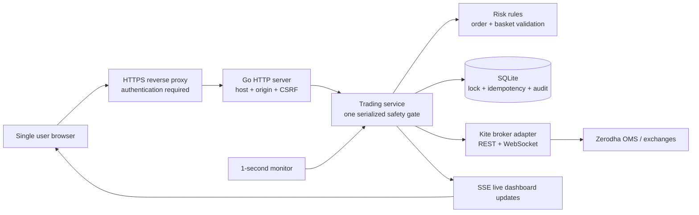
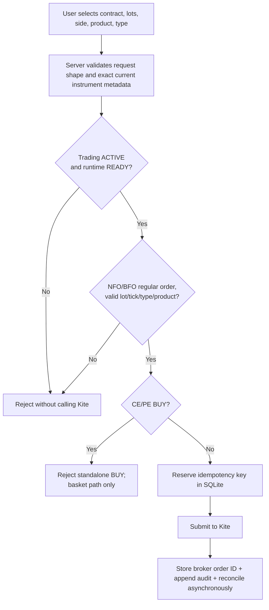
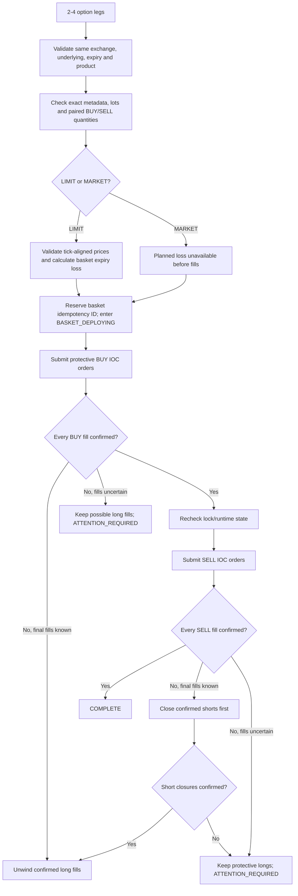
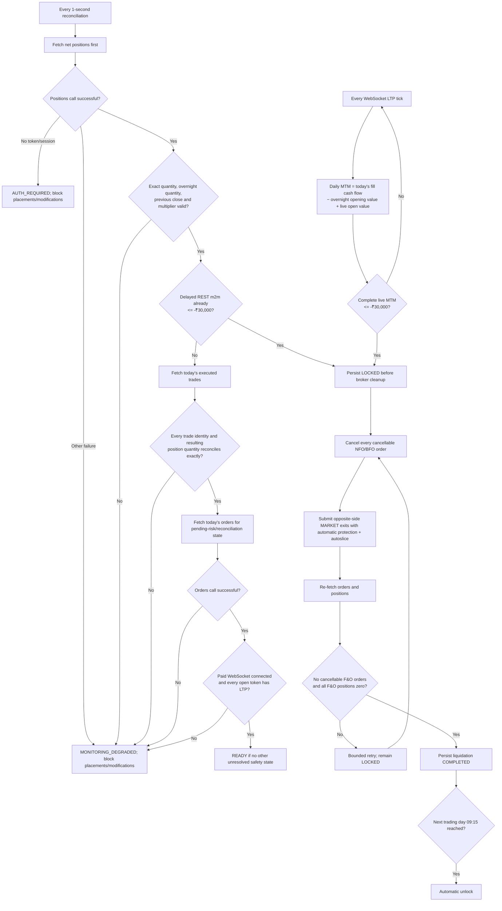

# TradeGuardian Product Guide

## What this product is

TradeGuardian is a single-user Zerodha Kite F&O order gateway. It sits between the dashboard and Zerodha, applies the trading rules described here, monitors the account's NFO/BFO mark-to-market (MTM), and permanently locks the trading day when the configured loss threshold is reached.

The application is implemented in Go. It uses Zerodha's official Go client, an embedded web dashboard, server-sent events for live refreshes, and SQLite for durable lock and audit state.

TradeGuardian is a safety layer, not an exchange, broker, strategy recommender, profit calculator, or guarantee against losses. Zerodha and exchange order execution remain asynchronous and can fail or partially fill.

## How the system works in one view



The trading service is the authority. The browser cannot approve an order, identify a hedge bypass, unlock trading, or invoke forced liquidation. The browser only sends a request; the Go service reads its current state, validates the broker instrument and resulting exposure, persists required safety state, and then decides whether the broker may be called.

There are two related state machines:

- **Trading state** is durable: `ACTIVE` or `LOCKED`. It survives restart in SQLite.
- **Runtime state** describes whether the current process can act safely: `AUTH_REQUIRED`, `READY`, `MONITORING_DEGRADED`, `BASKET_DEPLOYING`, or `LIQUIDATING`.

```mermaid
stateDiagram-v2
    [*] --> AUTH_REQUIRED: process starts
    AUTH_REQUIRED --> READY: Kite login + instruments + fresh positions/orders
    READY --> MONITORING_DEGRADED: broker/instrument/reconciliation failure
    MONITORING_DEGRADED --> READY: fresh successful poll and no unresolved rollback
    READY --> BASKET_DEPLOYING: validated basket begins
    BASKET_DEPLOYING --> MONITORING_DEGRADED: all fills/rollback confirmed; fresh portfolio poll still required
    BASKET_DEPLOYING --> MONITORING_DEGRADED: fills or rollback uncertain
    READY --> LIQUIDATING: MTM at or below loss limit
    MONITORING_DEGRADED --> LIQUIDATING: persisted lock needs cleanup
    LIQUIDATING --> AUTH_REQUIRED: Kite session unavailable
    LIQUIDATING --> READY: liquidation confirmed complete; trading remains LOCKED
```



`READY` does not mean trading is allowed by itself. `TradingStatus=LOCKED` always wins over the runtime state.

## Authoritative-data and no-fallback policy

TradeGuardian does not invent a broker value when Kite does not provide one. The safety decision uses these exact boundaries:

- positions and orders are joined to the current catalogue only by Kite's numeric `instrument_token`; matching exchange and trading symbol are also required;
- `lot_size` and `tick_size` must be positive broker values, and SDK quantity/lot values must convert to exact integers;
- the order book's `pending_quantity` is used exactly as reported; it is never calculated as quantity minus fills or cancellations;
- every modification must explicitly provide quantity, order type, validity, price, and trigger price as applicable; omitted fields are not copied from the old order;
- no underlying, expiry, strike, token, quantity, or price tick is parsed or guessed from `tradingsymbol`;
- a missing, duplicate, inconsistent, fractional, non-finite, or otherwise invalid safety field blocks the affected action or degrades monitoring instead of choosing a substitute.

A nonterminal order status is still treated conservatively as live for cancellation and reconciliation, including Kite's intermediate OMS states. That is a fail-closed status rule, not a quantity inference. TradeGuardian never invents a pending quantity for display, cancellation, or liquidation reconciliation.

The last valid MTM can remain visible during `MONITORING_DEGRADED`, but it is display-only: it is never used as if it were fresh data to approve an order. Application configuration values such as the loopback port and database path have documented defaults; those are deliberate application settings, not replacements for missing broker data.

## Single-order decision flow



The idempotency reservation happens **before** the broker call. If the network result is uncertain, the same key is not submitted again; the order book must be reconciled first. This avoids turning a timeout into a duplicate order. After an accepted placement or modification response, TradeGuardian returns the broker order ID but enters `MONITORING_DEGRADED` until a fresh positions/trades/orders reconciliation succeeds. Standalone option SELL is intentionally allowed without long-option coverage; standalone option BUY remains rejected.

## Basket deployment and failure flow



The most important rollback invariant is: **TradeGuardian never intentionally removes protective long fills while a short fill or its closing order is uncertain.** This can leave extra long options in the account after a failure, but it avoids deliberately creating naked shorts. `ATTENTION_REQUIRED` fails closed and needs broker reconciliation.

For a LIMIT basket, `Maximum planned loss` is the calculated expiry loss of the **new basket using its submitted limit prices**. It is not a whole-account maximum-loss figure, does not include fees/slippage, and does not describe losses before expiry. For a MARKET basket, planned loss is explicitly shown as unavailable because fill prices are unknown before execution; TradeGuardian never displays ₹0 as if it were a calculated maximum. MARKET legs use Kite automatic market protection, which can convert them to protected limits and can still reject or remain unfilled.

## Loss-monitor and liquidation flow



The daily-loss authority is the complete WebSocket-priced portfolio. For each exact `(instrument token, product)` position, TradeGuardian calculates `sell fill value − buy fill value − (overnight quantity × previous close × multiplier) + (current net quantity × WebSocket LTP × multiplier)`. This reconstructs today's mark-to-market from Kite's current-day tradebook and the position's overnight opening mark instead of trusting delayed `buy_m2m`/`sell_m2m` values. A flat position still contributes its realised fill cash flow; each nonzero position additionally requires a current WebSocket LTP. The service reconciles trade identities and `overnight quantity + buys − sells = current net quantity`, sums in rupees, and rounds once to integer paise. Any missing, duplicate, or inconsistent input fails closed. It locks synchronously inside the callback that observes exactly ₹−30,000 or lower, before the 100 ms UI coalescing interval can discard a brief breach.

The one-second reconciliation fetches positions, today's trades, and orders. Position `last_price`, `m2m`, `buy_m2m`, and `sell_m2m` are not treated as real-time. A delayed REST `m2m` already at/below the threshold is still a conservative backstop and locks immediately. The live decision does not wait for the orders endpoint once its position, tradebook, and tick inputs are complete. An order-book failure can delay cancellation/reconciliation, but cannot keep trading active after a known threshold breach.

The paid WebSocket must be connected even while the account is flat before TradeGuardian enables new exposure. With open positions, every token must also have a valid LTP. Disconnect, handshake failure, or incomplete token coverage immediately enters `MONITORING_DEGRADED`; placements and modifications are blocked while cancellations and explicit risk-reducing exits remain available.

Kite exposes several in-flight OMS states before an order becomes `OPEN`. TradeGuardian treats every status other than `COMPLETE`, `CANCELLED`, and `REJECTED` as live for cancellation and reconciliation. The dashboard displays Kite's reported `pending_quantity` unchanged. For option-exposure validation, a live SELL with zero, negative, or greater-than-total pending quantity is unverifiable and blocks new exposure; TradeGuardian does not derive a replacement value.

A forced exit response is only a submission acknowledgement, not an execution confirmation. TradeGuardian durably reserves a position-specific liquidation intent in SQLite **before** the broker call, replaces the reservation with the returned parent order ID, recognises autoslice children through their parent relationship, and will not submit a duplicate while that intent is absent from the order book or otherwise uncertain. If a forced exit is still live after its position is already flat, TradeGuardian cancels it to avoid creating a reverse position. Intent records survive restart and are removed only after reconciliation; unresolved `DAY` intents from an earlier IST date are expired after a fresh authenticated orders/positions poll because that order validity cannot remain live on the new day.

If persisting the initial lock fails, the process still locks in memory, starts liquidation, and retries the SQLite lock on later successful polls. A process/host failure during that narrow database-failure window cannot provide the normal restart guarantee; the dashboard and logs report the persistence failure.

The scheduled unlock is intentionally withheld unless liquidation is `COMPLETED`. If positions or orders remain unresolved at 09:15, the application stays `LOCKED`, requests a fresh Kite login when necessary, and continues reconciliation. This conservative choice is called out again under **Logic decisions to confirm**.

## Current user experience

### Starting a day

1. Open the dashboard and select **Connect Kite**.
2. Complete Zerodha's login. The daily access token is written to a separate owner-only cache so a same-day process restart can reuse it.
3. TradeGuardian remains fail-closed while it loads NFO/BFO instruments, obtains fresh positions/orders, connects the paid WebSocket, and receives LTPs for every open position. It continues reconciling REST portfolio state once per second.
4. Order submission becomes available only when the dashboard reports `ACTIVE` and `READY`.

The Kite session expires at approximately 06:00 the following day, so an interactive reconnect remains required once per trading day. On restart, TradeGuardian loads the cached token only before its recorded expiry and immediately validates it by reloading instruments, positions, and orders. An expired or Kite-rejected cache is deleted and the dashboard shows `AUTH_REQUIRED`; persistence never turns a stale token into an authenticated state.

### Finding a contract

Users do not enter a full Zerodha trading symbol or raw quantity.

- Select `NFO` or `BFO`.
- Search using a human-recognizable term such as `NIFTY`, `BANKNIFTY`, `SENSEX`, or part of a strike/symbol.
- Select a contract from the broker instrument results.
- Each result shows the trading symbol, broker-supplied underlying when present, expiry, strike and option type (or future), exchange, lot size, and broker tick size. Missing metadata is shown as unavailable, not replaced with a parsed symbol or default value.
- Enter the number of lots. TradeGuardian derives the exact broker quantity as `lots × lot size`.
- Editing the search text or changing the exchange clears the previous selection. An order cannot be submitted until a result is explicitly selected.

This prevents stale or mistyped symbols and non-lot quantities from being created by the dashboard. Price fields use only the selected instrument's positive broker tick size. The server validates exact token/symbol identity, metadata, lot multiple, and price/trigger tick alignment independently; browser behavior is never treated as a security boundary.

### Single-order ticket

The user selects contract, side, product, lots, and order type. Only meaningful price fields remain editable:

| Order type | Price | Trigger price |
| --- | --- | --- |
| MARKET | Not used | Not used |
| LIMIT | Required | Not used |
| SL | Required | Required |
| SL-M | Not used | Required |

The application currently supports regular orders on `NFO` and `BFO`, products `MIS` and `NRML`, and order types `MARKET`, `LIMIT`, `SL`, and `SL-M`.

Futures BUY and SELL requests are permitted when all other safety checks pass. A standalone CE or PE BUY is always rejected. An individual CE or PE SELL is permitted without an existing long option; this includes naked short-option exposure and applies equally to eligible placement and modification requests.

### Hedge basket

The basket builder is the only path through which option BUY legs may be deployed. It provides searchable contract selectors, lot-based quantity entry, per-row deletion, and a basket-wide MARKET or LIMIT execution choice. Blank rows are ignored; 2–4 selected legs are required.

Version one accepts baskets only when all of these conditions hold:

- all legs use the same exchange, product, underlying, and expiry;
- every leg is a CE or PE option;
- the basket contains both BUY and SELL legs;
- each sold CE/PE type has enough purchased quantity of the same option type to protect it;
- execution is either IOC LIMIT for all legs or IOC MARKET with Kite automatic market protection for all legs;
- LIMIT legs have positive tick-aligned prices; MARKET legs carry no client price;
- every contract has exact token, lot, tick, underlying, expiry, strike, and option-type metadata supplied by Kite;
- a LIMIT basket's maximum loss at expiry can be calculated and is finite; a MARKET basket is structurally bounded by its paired quantities but has no pre-fill monetary maximum;
- existing account positions and standalone naked SELL orders do not have to be covered by the new basket.

The supported shapes include same-expiry vertical spreads, iron condors, and iron flies that satisfy those basket invariants. Calendar spreads, diagonal spreads, ratio baskets whose new SELL quantity exceeds the paired BUY quantity, cross-underlying baskets, futures-option combinations, saved approvals, and reusable hedge permissions are not supported. These basket restrictions do not prohibit a separate standalone naked option SELL.

Kite does not provide an atomic multi-leg basket placement operation. TradeGuardian therefore:

1. validates and simulates the complete basket;
2. submits protective BUY IOC legs first, using the selected LIMIT prices or MARKET with automatic protection;
3. confirms the BUY fills;
4. submits SELL IOC legs only after protection exists;
5. reconciles all fills;
6. on an incomplete phase with known fills, cancels outstanding legs, closes filled shorts first, confirms those closures, and only then unwinds long quantities filled by this basket;
7. when fills or short closures are uncertain, retains protective longs and enters `ATTENTION_REQUIRED`/degraded state.

A basket result is not reported complete until broker reconciliation confirms the expected fills. Even then, new placements remain temporarily fail-closed until a fresh full positions/orders poll updates the portfolio snapshot. A failed rollback is shown as requiring attention and keeps the runtime fail-closed.

## Daily loss control

The fixed version-one threshold is ₹30,000. Fees and taxes are excluded. TradeGuardian reconstructs today's MTM for every NFO/BFO position from the current-day tradebook, overnight quantity at previous close, current net quantity, multiplier, and WebSocket LTP. It sums the complete portfolio in rupees, rounds once to integer paise, and evaluates:

```text
F&O MTM <= -₹30,000.00
```

At exactly the threshold or below it, TradeGuardian performs this sequence:

1. atomically persists `LOCKED` in SQLite before any broker operation;
2. publishes `Daily Loss Limit Reached. Trading Locked Until Tomorrow.`;
3. cancels all cancellable NFO/BFO orders;
4. submits opposite-side protected MARKET exits for every nonzero NFO/BFO position;
5. repeatedly reconciles orders and positions using bounded retries;
6. reports liquidation complete only when no cancellable F&O order and no nonzero F&O position remains.

The lock survives restarts and broker/network failures. Every placement and modification is rejected while locked. Cancellations and internal/risk-reducing full-position exits remain available. There is no unlock button, API route, browser flag, or general risk bypass.

An explicit full exit of any exact future or option position is permitted as a direct position-reducing action, including closing a positive long option even if naked shorts remain. Daily-loss liquidation is a separate internal operation that closes the entire F&O account scope and does not selectively preserve strategy legs.

If any required position, trade, or tick field is missing, duplicated, inconsistent, non-finite, or outside the supported range, TradeGuardian does not compare a fabricated number with the loss threshold. It retains the last valid value only as a labelled diagnostic, enters `MONITORING_DEGRADED`, and blocks new placements/modifications until a complete fresh state succeeds.

The next scheduled unlock is 09:15 Asia/Kolkata on the next Monday–Friday that is not listed as an exchange holiday. Unlock occurs only after liquidation is confirmed `COMPLETED`; otherwise the lock remains. After changing to `ACTIVE`, order entry remains fail-closed until a fresh positions/orders poll succeeds. Startup also performs an overdue eligible unlock. The annual holiday configuration must be reviewed and replaced before each calendar year. Startup rejects malformed dates, dates outside the declared year, duplicates, and a date listed as both a holiday and special trading day. If the next day falls outside the configured calendar year, unlock time is left unset (fail-closed). Special sessions remain treated as closed unless explicitly configured as supported trading days.

## Runtime states shown in the dashboard

| State | Meaning | Order behavior |
| --- | --- | --- |
| `ACTIVE` | The durable trading day is not loss-locked | Runtime state still decides whether orders can be placed |
| `LOCKED` | Daily threshold was breached | Placements/modifications rejected; cancellations remain available |
| `AUTH_REQUIRED` | No usable Kite session exists | Placements/modifications unavailable |
| `READY` | Fresh monitoring data is available | Eligible requests may pass rule checks |
| `MONITORING_DEGRADED` | Position polling failed or fresh risk state is unavailable | Fails closed; cancellation and product-specific full risk-reducing exits remain available |
| `BASKET_DEPLOYING` | A validated basket is being placed/reconciled | Other placement is serialized/blocked |
| `LIQUIDATING` | Loss-limit cleanup is in progress | Trading remains locked |

The dashboard continuously displays F&O MTM, trading state, monitor state, last refresh, open quantity, pending-order count, liquidation state, next unlock, positions, orders, and the append-only audit stream. After every monitor cycle, the server pushes one coherent status/positions/orders snapshot over SSE; the browser does not poll Kite or require a manual refresh. The stream reconnects automatically if the network briefly drops and shows its connection state beside Positions.

The server maintains Kite's authenticated WebSocket connection and subscribes in LTP mode to the exact tokens of current nonzero F&O positions. The browser never receives the Kite access token and never connects to Kite directly. Complete states calculate both the displayed position MTM and the authoritative ₹30,000 risk value from current-day executions, overnight quantity/previous close, current quantity/multiplier, and WebSocket LTP. Threshold checks happen on every complete tick state; only browser rendering is coalesced to at most 10 frames per second. WebSocket order events request immediate REST reconciliation.

The REST snapshot is shown separately for diagnosis because Zerodha may refresh it only after several minutes. It is not labelled live and cannot enable trading in place of WebSocket data. If the feed disconnects or any open position lacks a valid tick/formula input, the UI shows `MONITORING_DEGRADED`, disables order/basket entry, and never presents a partial portfolio as live.

Instrument search uses an in-memory bigram index built from Kite's authoritative trading symbol and name fields when the daily catalogue loads. The browser waits only 60 ms after a keystroke and cancels superseded requests, so fast typing neither scans the full derivative catalogue nor queues stale responses. Indexed candidates are still checked against the exact exchange, contract kind, symbol/name substring, and execution metadata before display or order validation.

## Direct Kite activity

Pre-trade enforcement covers only requests sent through TradeGuardian. An order placed directly in Kite bypasses the TradeGuardian order gate because Kite does not call this application before accepting it. However, resulting NFO/BFO positions affect monitored MTM and can trigger the account-wide lock and liquidation workflow. During a lock, liquidation also cancels direct Kite NFO/BFO pending orders and exits direct Kite NFO/BFO positions. If new exposure appears after liquidation was marked complete but while the account is still locked, liquidation is returned to `IN_PROGRESS`. Continuing to trade directly in Kite while liquidation is running can race the cleanup and is unsafe.

## Persistence and audit

SQLite stores:

- the authoritative `ACTIVE`/`LOCKED` state;
- lock date, trigger MTM/time, intended unlock, liquidation progress, and last error;
- durable, position-specific liquidation intent reservations used to prevent duplicate exits across timeouts and restarts;
- idempotency reservations written before broker submission, followed by the confirmed broker order ID;
- append-only, redacted decision and broker-operation audit events.

Audit writes are best-effort after the safety decision or broker call. If SQLite itself becomes unavailable, TradeGuardian logs the audit failure and continues with the safer in-memory action; it cannot truthfully guarantee an audit row for that event. Requests rejected by HTTP parsing, origin, or CSRF checks are transport-security failures rather than trading decisions and are not written to the trading audit table.

The database does not store the Kite API key, API secret, daily access token, request token, cookies, or authentication headers. API credentials are read from the protected process environment. The daily access token is the only session secret persisted by TradeGuardian: it is kept in a separate `0600` JSON file, never returned to the browser or logs, expires at the next 06:00 IST boundary, and is deleted when expired or rejected by Kite. This protects against ordinary users but, like all credentials on the VPS, cannot protect against VPS root compromise.

Back up `data/tradeguardian.db` only while the application is stopped. Exclude `kite-session.json` because it is a short-lived bearer credential, not recovery state. Run only one TradeGuardian process against a database. Restoring an older backup can restore older lock state, so never edit the database to remove a lock.

## HTTP and browser security

Mutating requests require all of the following:

- the configured public host;
- an exact same-origin `Origin` header;
- a matching strict, HTTP-only CSRF cookie and request header;
- a request body below the configured size limit;
- strict JSON decoding with unknown fields rejected;
- server-side instrument, order, position, status, and idempotency validation.

For HTTPS deployments, authentication-state and CSRF cookies are marked `Secure`. Secrets and tokens are not rendered in HTML, returned by APIs, or written to logs/audit records.

Dashboard, API, and event-stream responses use `Cache-Control: no-store`, so account state is not intentionally retained by browser or proxy caches.

## VPS deployment model

The intended VPS has 4 vCPU and 8 GB RAM. That is comfortably above the application's expected resource requirement; the normal load is one user, one SQLite database, a Kite WebSocket, one browser SSE connection, and one monitor cycle per second (normally one positions call plus one orders call). The broker adapter spaces API calls below Kite's documented 10 requests/second limit. More CPU or memory does not improve broker execution latency.

The safe topology is:

```text
Two authorised users -> Tailscale identity/grants -> Tailscale Serve HTTPS -> 127.0.0.1:8080 TradeGuardian -> Kite API
```

TradeGuardian deliberately continues to bind only to `127.0.0.1`. The reverse proxy should be the only process able to reach it. Do not expose port 8080 through the VPS firewall.

The application does not contain its own user login. The selected deployment uses Tailscale identity and narrow tailnet grants as the authentication boundary, with equal access for the two authorised users. Tailscale Serve provides private HTTPS at `tradeguardian.tail020b72.ts.net`; Funnel must remain disabled. Neither user needs a static home IP. The VPS public egress address—not the users' addresses or the Tailscale address—is registered in Kite's order-IP whitelist. Exact installation and recovery instructions are maintained in `DEPLOYMENT.md`.

The VPS is dual-stack, but the Kite REST adapter deliberately uses IPv4-only dialing so placement, modification, and cancellation consistently originate from the registered static IPv4 `147.93.169.168`. This restriction applies only to the broker HTTP clients and avoids nondeterministic IPv4/IPv6 whitelist behavior.

Set these environment variables in the VPS service manager, not in the repository:

```text
KITE_API_KEY=<secret>
KITE_API_SECRET=<secret>
TRADEGUARDIAN_PORT=8080
TRADEGUARDIAN_PUBLIC_ORIGIN=https://tradeguardian.tail020b72.ts.net
TRADEGUARDIAN_DB=/var/lib/tradeguardian/tradeguardian.db
TRADEGUARDIAN_SESSION_CACHE=/var/lib/tradeguardian/kite-session.json
TRADING_CALENDAR=/opt/tradeguardian/config/trading_holidays_2026.json
```

Register the matching Kite redirect URL:

```text
https://tradeguardian.tail020b72.ts.net/auth/callback
```

The process should run as a dedicated unprivileged OS user, restart on failure, receive `SIGTERM` for graceful shutdown, and have write access only to its data directory. The reverse proxy should preserve the original `Host` and `Origin`; TradeGuardian does not trust forwarded headers to widen its origin policy.

This application is stateful. Do not run multiple replicas against the same SQLite file. A 4-vCPU/8-GB VPS should run one application process and one reverse proxy.

## Configuration reference

| Variable | Required/default | Purpose |
| --- | --- | --- |
| `KITE_API_KEY` | Required | Zerodha application key |
| `KITE_API_SECRET` | Required | Zerodha application secret |
| `TRADEGUARDIAN_PORT` | `8080` | Loopback HTTP port |
| `TRADEGUARDIAN_PUBLIC_ORIGIN` | `http://127.0.0.1:<port>` | Exact browser origin allowed for mutations and secure-cookie behavior; VPS uses the private Tailscale HTTPS origin |
| `TRADEGUARDIAN_DB` | `data/tradeguardian.db` | SQLite file |
| `TRADEGUARDIAN_SESSION_CACHE` | Beside the SQLite file as `kite-session.json` | Owner-only, short-lived Kite access-token cache used for same-day restarts |
| `TRADING_CALENDAR` | `config/trading_holidays_2026.json` | Versioned unlock calendar |

Zerodha published sandbox documentation before launching sandbox user access. TradeGuardian therefore has no runtime sandbox mode: a dashboard that cannot authenticate would create false confidence. Ordinary automated tests use a deterministic fake broker and never place live orders. No automatic live-account mutation test exists. A later minimal controlled production check is required only to confirm actual Zerodha execution behavior after static-IP, credentials, callback, and all safety controls are verified.

The fake broker is an in-process test double used only by automated tests, never by the running application. A test tells it exactly what Zerodha should appear to do—fill partially, reject, time out after accepting, expose an autoslice child, report −₹30,000 MTM, or remain unavailable—and then verifies TradeGuardian's lock, retry, reconciliation, and audit behaviour. This proves our deterministic response to each scenario without claiming that it proves the real exchange will behave identically.

## Logic decisions to confirm

These are the highest-impact current interpretations. They are written plainly so you can correct any misunderstanding before live use.

| Topic | Current implemented behavior | Why this matters |
| --- | --- | --- |
| Loss number | Reconstructs today's NFO/BFO MTM from Kite executions, overnight quantity/previous close, current quantity/multiplier, and WebSocket LTP; includes positions opened outside TradeGuardian and excludes charges/other segments | Flat realised P&L is not allowed to remain stale, direct Kite activity still counts, and the number is not post-charges account P&L |
| Threshold | Locks synchronously on the first complete WebSocket-priced state at exactly −₹30,000 or lower; delayed REST `m2m` is a conservative backstop | Feed, network, broker processing, and exit slippage mean this is not a guaranteed execution price or maximum final loss |
| Liquidation scope | Cancels all pending NFO/BFO orders first, then exits all nonzero NFO/BFO positions regardless of origin or strategy | It does not preserve a profitable hedge/leg after the daily account loss is breached |
| Scheduled unlock | 09:15 next configured trading day, but only after liquidation is confirmed complete | An unresolved broker position can keep the next day locked; there is no manual override |
| Standalone option BUY | Always rejected, even though a long option has limited premium risk | This is a discipline rule, not a mathematical naked-risk rule |
| Standalone option SELL | Allowed without long-option coverage | This intentionally permits naked short-option risk; the daily MTM lock remains the account-level loss control |
| Basket meaning | BUY options are allowed only inside a single-use 2–4 leg same-expiry basket | A BUY is not approved merely because the user intends to sell another leg later |
| Existing exposure | Existing naked shorts do not invalidate a new internally paired basket | Basket validation controls the option-BUY exception, not all account short-option exposure |
| Maximum planned loss | Calculated only for LIMIT baskets; explicitly unavailable before MARKET fills | It is never reported as ₹0 for MARKET and is not whole-account risk, margin, slippage, or charges |
| Rollback priority | If short closure is uncertain, protective longs are kept and trading degrades | Failure can leave extra long premium exposure, intentionally preferred over leaving naked shorts |
| MARKET protection | Basket MARKET legs and forced exits use automatic market protection; forced exits also use autoslice | Market protection converts to a protected limit and can remain unfilled/rejected; “market” is not an execution guarantee |
| Exit uncertainty | A submitted forced exit is not duplicated until its parent/children are visible and terminal; an orphan live exit is cancelled after the position is flat | The application may remain locked/degraded while the OMS is uncertain, preferring delay over an accidental reverse position |
| Unknown metadata | Instruments, positions, trades, and orders must retain exact broker identity and numeric metadata for the operation that uses them | Expired/stale catalogue gaps can reduce availability, but are never resolved by symbol parsing, default ticks, or derived quantities |
| Direct Kite orders | Cannot be pre-blocked; monitor/liquidator still sees them | Direct trading can defeat pre-trade discipline and can race liquidation |
| Calendar boundary | Missing next-year calendar leaves unlock unset/fail-closed | Annual calendar maintenance is operationally mandatory before year end |

If any row is not your intended policy, change it before connecting a production account.

## Current limitations and pending decisions

- The daily loss threshold is fixed at ₹30,000 and has no intraday override.
- Fees, taxes, equity, currency, and commodity P&L are not included.
- Direct Kite order placement cannot be pre-blocked.
- Kite basket placement is coordinated but not exchange-atomic.
- A richer modification dialog still uses a basic browser prompt; its server request remains guarded.
- Instrument search requires the daily authenticated instrument load.
- Basket grouping uses the exact broker-supplied `name` value as the derivative family identifier; it never parses the trading symbol. This was checked directly against Kite's public daily dumps on 22 July 2026: all 37,690 NFO option rows and all 4,574 BFO option rows had a nonempty name (for example `NIFTY`, `BANKNIFTY`, `SENSEX`, and `BANKEX`). Zerodha's formal column description and old example are incomplete here, but Zerodha's developer guidance also identifies `name` as the NFO family field. If a future dump omits it, only the affected option operation fails closed.
- Kite WebSocket order events prompt immediate authoritative REST reconciliation. Exchange, OMS, network, and REST response latency can still delay final broker-confirmed state.
- Only the documented basket shapes/invariants are supported; strategy templates and saved baskets are future product choices.
- The VPS and Tailscale identity boundary are configured. Production credentials, Kite IP whitelist/callback confirmation, private HTTPS publication, firewall hardening, backups, and final live readiness verification remain deployment work.
- The exchange holiday file requires annual maintenance.
- The displayed basket maximum loss is not a whole-portfolio risk engine and no margin API check is performed before placement.

## Broker sources used by the implementation

- [Kite order placement, current-day tradebook, modification, cancellation, status, and response fields](https://kite.trade/docs/connect/v3/orders/)
- [Kite instrument dump, instrument token, lot size, and tick size](https://kite.trade/docs/connect/v3/market-data-and-instruments/)
- [Zerodha guidance on using the NFO `name` field](https://kite.trade/forum/discussion/6423/finding-underlying-future-and-options)
- [Current public NFO instrument dump](https://api.kite.trade/instruments/NFO) and [current public BFO instrument dump](https://api.kite.trade/instruments/BFO)
- [Kite net positions and `m2m`](https://kite.trade/docs/connect/v3/portfolio/)
- [Zerodha live MTM formula using WebSocket/Quote LTP](https://kite.trade/forum/discussion/12739/position-m2m-formula)
- [Kite WebSocket streaming](https://kite.trade/docs/connect/v3/websocket/)
- [Kite authentication and daily token expiry](https://kite.trade/docs/connect/v3/user/)
- [Official Zerodha Go SDK v4](https://pkg.go.dev/github.com/zerodha/gokiteconnect/v4)

## How to request modifications

When asking for a change, describe the desired behavior in product terms—for example:

- “Allow calendar spreads only when …”
- “Add a saved iron-condor template with these editable fields …”
- “Include charges in the daily threshold using this source …”
- “Replace the modify-order prompt with an inline ticket …”
- “Deploy behind this domain and this authentication provider …”

Any change to order eligibility, basket validation, loss calculation, lock/unlock behavior, liquidation, or authentication is a safety-policy change and must include tests and an update to this document and `plan.md`.

## Source map for maintainers

- `cmd/tradeguardian`: startup, environment configuration, loopback server, graceful shutdown.
- `internal/broker`: production Kite adapter.
- `internal/risk`: single-order and basket policy validation/payoff checks.
- `internal/service`: serialized decisions, monitoring, basket coordination, liquidation, reconciliation, and runtime state.
- `internal/store`: SQLite migrations and durable state/audit.
- `internal/httpapi`: protected routes, SSE, embedded dashboard, and browser behavior.
- `internal/calendar`: holiday validation and automatic unlock calculation.
- `config`: versioned trading calendar.
- `AGENTS.md`: non-negotiable engineering and safety practices.
- `plan.md`: implemented scope and risk-policy plan.
