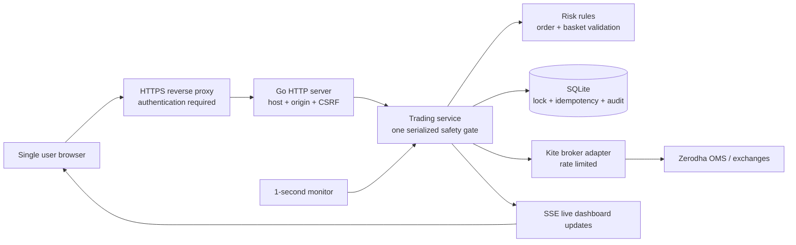
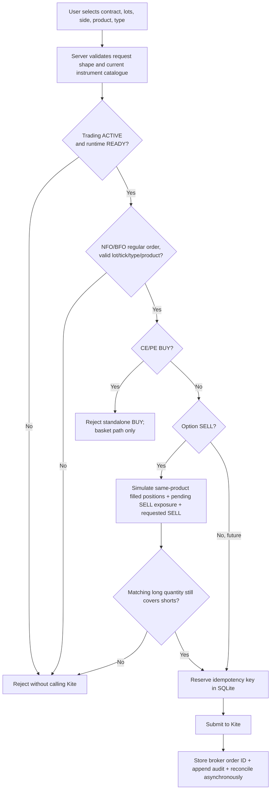
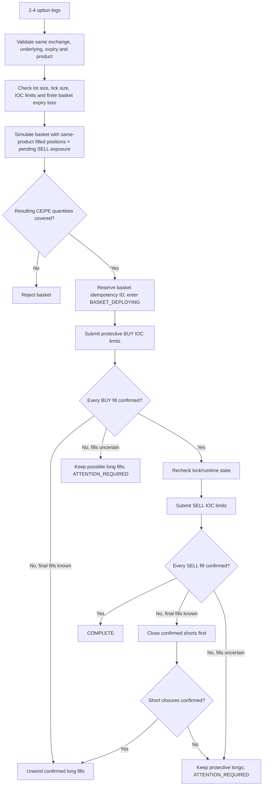
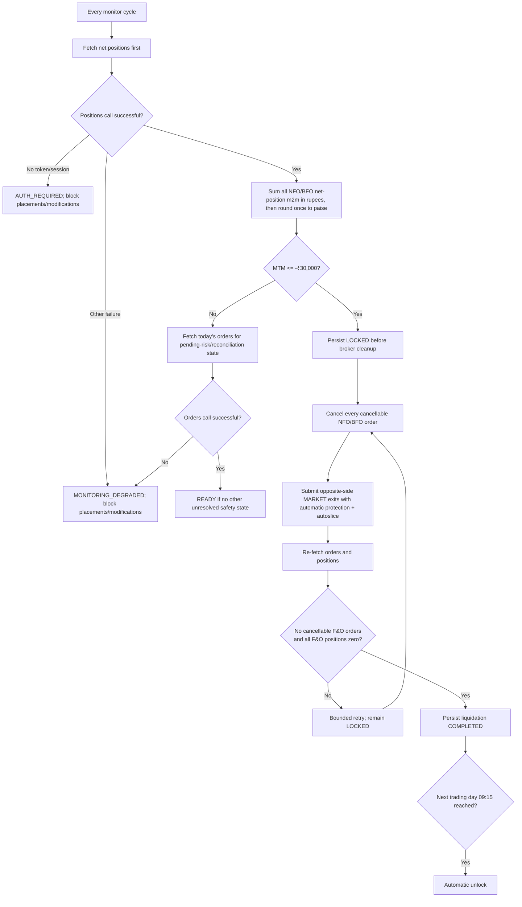

# TradeGuardian Product Guide

## What this product is

TradeGuardian is a single-user Zerodha Kite F&O order gateway. It sits between the dashboard and Zerodha, applies the trading rules described here, monitors the account's NFO/BFO mark-to-market (MTM), and permanently locks the trading day when the configured loss threshold is reached.

The application is implemented in Go. It uses Zerodha's official Go client, an embedded web dashboard, server-sent events for live refreshes, and SQLite for durable lock and audit state.

TradeGuardian is a safety layer, not an exchange, broker, strategy recommender, profit calculator, or guarantee against losses. Zerodha and exchange order execution remain asynchronous and can fail or partially fill.

## How the system works in one view



The trading service is the authority. The browser cannot approve an order, identify a hedge bypass, unlock trading, or invoke forced liquidation. The browser only sends a request; the Go service reads its current state, validates the broker instrument and resulting exposure, persists required safety state, and then decides whether the broker may be called.

There are two related state machines:

- **Trading state** is durable: `ACTIVE` or `LOCKED`. It survives restart in SQLite.
- **Runtime state** describes whether the current process can act safely: `AUTH_REQUIRED`, `READY`, `MONITORING_DEGRADED`, `BASKET_DEPLOYING`, or `LIQUIDATING`.

```mermaid
stateDiagram-v2
    [*] --> AUTH_REQUIRED: process starts
    AUTH_REQUIRED --> READY: Kite login + instruments + fresh positions/orders
    READY --> MONITORING_DEGRADED: broker/instrument/reconciliation failure
    MONITORING_DEGRADED --> READY: fresh successful poll and no unresolved rollback
    READY --> BASKET_DEPLOYING: validated basket begins
    BASKET_DEPLOYING --> MONITORING_DEGRADED: all fills/rollback confirmed; fresh portfolio poll still required
    BASKET_DEPLOYING --> MONITORING_DEGRADED: fills or rollback uncertain
    READY --> LIQUIDATING: MTM at or below loss limit
    MONITORING_DEGRADED --> LIQUIDATING: persisted lock needs cleanup
    LIQUIDATING --> AUTH_REQUIRED: Kite session unavailable
    LIQUIDATING --> READY: liquidation confirmed complete; trading remains LOCKED
```



`READY` does not mean trading is allowed by itself. `TradingStatus=LOCKED` always wins over the runtime state.

## Single-order decision flow



The idempotency reservation happens **before** the broker call. If the network result is uncertain, the same key is not submitted again; the order book must be reconciled first. This avoids turning a timeout into a duplicate order. After an accepted order response, its full quantity is immediately cached as pending until the next broker poll; this conservative reservation prevents two rapid SELLs from using the same long-option coverage.

## Basket deployment and failure flow



The most important rollback invariant is: **TradeGuardian never intentionally removes protective long fills while a short fill or its closing order is uncertain.** This can leave extra long options in the account after a failure, but it avoids deliberately creating naked shorts. `ATTENTION_REQUIRED` fails closed and needs broker reconciliation.

The displayed `Maximum planned loss` is the calculated expiry loss of the **new basket using its submitted limit prices**. It is not a whole-account maximum-loss figure, does not include fees/slippage, and does not describe losses before expiry. Same-product filled positions and pending SELL exposure are used for coverage validation, but their historical entry prices are not included in that number. An unfilled pending BUY never counts as protection because the new SELL could execute first. MIS and NRML quantities are not treated as interchangeable protection.

## Loss-monitor and liquidation flow



The MTM decision does **not** wait for the orders endpoint. A successful positions response at or below the threshold locks immediately even when reading the order book fails. The order-book failure can delay cancellation/reconciliation, but it cannot keep trading active after a known threshold breach.

If persisting the initial lock fails, the process still locks in memory, starts liquidation, and retries the SQLite lock on later successful polls. A process/host failure during that narrow database-failure window cannot provide the normal restart guarantee; the dashboard and logs report the persistence failure.

The scheduled unlock is intentionally withheld unless liquidation is `COMPLETED`. If positions or orders remain unresolved at 09:15, the application stays `LOCKED`, requests a fresh Kite login when necessary, and continues reconciliation. This conservative choice is called out again under **Logic decisions to confirm**.

## Current user experience

### Starting a day

1. Open the dashboard and select **Connect Kite**.
2. Complete Zerodha's login. The resulting daily access token is held only in application memory.
3. TradeGuardian remains fail-closed while it loads NFO/BFO instruments and obtains fresh positions and orders, then begins polling positions once per second.
4. Order submission becomes available only when the dashboard reports `ACTIVE` and `READY`.

The Kite session expires daily, so reconnecting is normally required on the next trading day. A missing session is shown as `AUTH_REQUIRED`; it does not silently turn off risk protection.

### Finding a contract

Users do not enter a full Zerodha trading symbol or raw quantity.

- Select `NFO` or `BFO`.
- Search using a human-recognizable term such as `NIFTY`, `BANKNIFTY`, `SENSEX`, or part of a strike/symbol.
- Select a contract from the broker instrument results.
- Each result shows the trading symbol, underlying, expiry, strike and option type (or future), exchange, lot size, and broker tick size.
- Enter the number of lots. TradeGuardian derives the exact broker quantity as `lots × lot size`.
- Editing the search text or changing the exchange clears the previous selection. An order cannot be submitted until a result is explicitly selected.

This prevents stale or mistyped symbols and non-lot quantities from being created by the dashboard. Price fields use the selected instrument's broker tick size. The server still validates symbol, metadata, lot multiple, and price/trigger tick alignment independently; browser behavior is never treated as a security boundary.

### Single-order ticket

The user selects contract, side, product, lots, and order type. Only meaningful price fields remain editable:

| Order type | Price | Trigger price |
| --- | --- | --- |
| MARKET | Not used | Not used |
| LIMIT | Required | Not used |
| SL | Required | Required |
| SL-M | Not used | Required |

The application currently supports regular orders on `NFO` and `BFO`, products `MIS` and `NRML`, and order types `MARKET`, `LIMIT`, `SL`, and `SL-M`.

Futures BUY and SELL requests are permitted when all other safety checks pass. A standalone CE or PE BUY is always rejected. An individual option SELL is permitted only when same-product filled positions, pending SELL exposure, and the requested SELL prove that sufficient matching long-option quantity already exists. Pending BUY orders do not count as protection.

### Hedge basket

The basket builder is the only path through which option BUY legs may be deployed. Each of its 2–4 legs uses the same searchable contract selector and lot-based quantity entry.

Version one accepts baskets only when all of these conditions hold:

- all legs use the same exchange, product, underlying, and expiry;
- every leg is a CE or PE option;
- the basket contains both BUY and SELL legs;
- each sold CE/PE type has enough purchased quantity of the same option type to protect it;
- every leg has an IOC limit price;
- maximum loss at expiry can be calculated and is finite.
- after applying the basket to same-product filled positions and pending SELL exposure, the affected CE/PE groups do not retain uncovered short quantity; pending BUY orders are not counted as protection until filled and MIS does not cover NRML (or vice versa).

The supported shapes include same-expiry vertical spreads, iron condors, and iron flies that satisfy those invariants. Calendar spreads, diagonal spreads, ratio spreads with uncovered quantity, cross-underlying baskets, futures-option combinations, saved approvals, and reusable hedge permissions are not supported.

Kite does not provide an atomic multi-leg basket placement operation. TradeGuardian therefore:

1. validates and simulates the complete basket;
2. submits protective BUY IOC legs first;
3. confirms the BUY fills;
4. submits SELL IOC legs only after protection exists;
5. reconciles all fills;
6. on an incomplete phase with known fills, cancels outstanding legs, closes filled shorts first, confirms those closures, and only then unwinds long quantities filled by this basket;
7. when fills or short closures are uncertain, retains protective longs and enters `ATTENTION_REQUIRED`/degraded state.

A basket result is not reported complete until broker reconciliation confirms the expected fills. Even then, new placements remain temporarily fail-closed until a fresh full positions/orders poll updates the portfolio snapshot. A failed rollback is shown as requiring attention and keeps the runtime fail-closed.

## Daily loss control

The fixed version-one threshold is ₹30,000. Fees and taxes are excluded. On every successful monitor poll, TradeGuardian sums the `m2m` values of all net positions whose exchange is `NFO` or `BFO` in rupees, then rounds the total once to integer paise and evaluates:

```text
F&O MTM <= -₹30,000.00
```

At exactly the threshold or below it, TradeGuardian performs this sequence:

1. atomically persists `LOCKED` in SQLite before any broker operation;
2. publishes `Daily Loss Limit Reached. Trading Locked Until Tomorrow.`;
3. cancels all cancellable NFO/BFO orders;
4. submits opposite-side protected MARKET exits for every nonzero NFO/BFO position;
5. repeatedly reconciles orders and positions using bounded retries;
6. reports liquidation complete only when no cancellable F&O order and no nonzero F&O position remains.

The lock survives restarts and broker/network failures. Every placement and modification is rejected while locked. Cancellations and internal/risk-reducing full-position exits remain available. There is no unlock button, API route, browser flag, or general risk bypass.

The next scheduled unlock is 09:15 Asia/Kolkata on the next Monday–Friday that is not listed as an exchange holiday. Unlock occurs only after liquidation is confirmed `COMPLETED`; otherwise the lock remains. After changing to `ACTIVE`, order entry remains fail-closed until a fresh positions/orders poll succeeds. Startup also performs an overdue eligible unlock. The annual holiday configuration must be reviewed and replaced before each calendar year. Startup rejects malformed dates, dates outside the declared year, duplicates, and a date listed as both a holiday and special trading day. If the next day falls outside the configured calendar year, unlock time is left unset (fail-closed). Special sessions remain treated as closed unless explicitly configured as supported trading days.

## Runtime states shown in the dashboard

| State | Meaning | Order behavior |
| --- | --- | --- |
| `ACTIVE` | The durable trading day is not loss-locked | Runtime state still decides whether orders can be placed |
| `LOCKED` | Daily threshold was breached | Placements/modifications rejected; cancellations remain available |
| `AUTH_REQUIRED` | No usable Kite session exists | Placements/modifications unavailable |
| `READY` | Fresh monitoring data is available | Eligible requests may pass rule checks |
| `MONITORING_DEGRADED` | Position polling failed or fresh risk state is unavailable | Fails closed; cancellation and product-specific full risk-reducing exits remain available |
| `BASKET_DEPLOYING` | A validated basket is being placed/reconciled | Other placement is serialized/blocked |
| `LIQUIDATING` | Loss-limit cleanup is in progress | Trading remains locked |

The dashboard continuously displays F&O MTM, trading state, monitor state, last refresh, open quantity, pending-order count, liquidation state, next unlock, positions, orders, and the append-only audit stream.

## Direct Kite activity

Pre-trade enforcement covers only requests sent through TradeGuardian. An order placed directly in Kite bypasses the TradeGuardian order gate because Kite does not call this application before accepting it. However, resulting NFO/BFO positions affect monitored MTM and can trigger the account-wide lock and liquidation workflow. During a lock, liquidation also cancels direct Kite NFO/BFO pending orders and exits direct Kite NFO/BFO positions. If new exposure appears after liquidation was marked complete but while the account is still locked, liquidation is returned to `IN_PROGRESS`. Continuing to trade directly in Kite while liquidation is running can race the cleanup and is unsafe.

## Persistence and audit

SQLite stores:

- the authoritative `ACTIVE`/`LOCKED` state;
- lock date, trigger MTM/time, intended unlock, liquidation progress, and last error;
- idempotency reservations written before broker submission, followed by the confirmed broker order ID;
- append-only, redacted decision and broker-operation audit events.

Audit writes are best-effort after the safety decision or broker call. If SQLite itself becomes unavailable, TradeGuardian logs the audit failure and continues with the safer in-memory action; it cannot truthfully guarantee an audit row for that event. Requests rejected by HTTP parsing, origin, or CSRF checks are transport-security failures rather than trading decisions and are not written to the trading audit table.

The database does not store the Kite API key, API secret, daily access token, request token, cookies, or authentication headers. Credentials are read from process environment variables; the access token remains in process memory.

Back up `data/tradeguardian.db` only while the application is stopped. Run only one TradeGuardian process against a database. Restoring an older backup can restore older lock state, so never edit the database to remove a lock.

## HTTP and browser security

Mutating requests require all of the following:

- the configured public host;
- an exact same-origin `Origin` header;
- a matching strict, HTTP-only CSRF cookie and request header;
- a request body below the configured size limit;
- strict JSON decoding with unknown fields rejected;
- server-side instrument, order, position, status, and idempotency validation.

For HTTPS deployments, authentication-state and CSRF cookies are marked `Secure`. Secrets and tokens are not rendered in HTML, returned by APIs, or written to logs/audit records.

## VPS deployment model

The intended VPS has 4 vCPU and 8 GB RAM. That is comfortably above the application's expected resource requirement; the normal load is one user, one SQLite database, one SSE connection, and one monitor cycle per second (normally one positions call plus one orders call). The broker adapter spaces API calls below Kite's documented 10 requests/second limit. More CPU or memory does not improve broker execution latency.

The safe topology is:

```text
Browser -> HTTPS + single-user authentication -> reverse proxy -> 127.0.0.1:8080 TradeGuardian -> Kite API
```

TradeGuardian deliberately continues to bind only to `127.0.0.1`. The reverse proxy should be the only process able to reach it. Do not expose port 8080 through the VPS firewall.

The application does not yet contain its own user login. Before exposing the dashboard through a public domain, the reverse proxy must enforce a single-user authentication layer with MFA where possible (for example, a private VPN/tailnet or an identity-aware access proxy). TLS alone is not authentication. The final domain and authentication choice are deployment decisions still to be supplied.

Set these environment variables in the VPS service manager, not in the repository:

```text
KITE_API_KEY=<secret>
KITE_API_SECRET=<secret>
KITE_MODE=production
TRADEGUARDIAN_PORT=8080
TRADEGUARDIAN_PUBLIC_ORIGIN=https://trade.example.com
TRADEGUARDIAN_DB=/var/lib/tradeguardian/tradeguardian.db
TRADING_CALENDAR=/opt/tradeguardian/config/trading_holidays_2026.json
```

Register the matching Kite redirect URL:

```text
https://trade.example.com/auth/callback
```

The process should run as a dedicated unprivileged OS user, restart on failure, receive `SIGTERM` for graceful shutdown, and have write access only to its data directory. The reverse proxy should preserve the original `Host` and `Origin`; TradeGuardian does not trust forwarded headers to widen its origin policy.

This application is stateful. Do not run multiple replicas against the same SQLite file. A 4-vCPU/8-GB VPS should run one application process and one reverse proxy.

## Configuration reference

| Variable | Required/default | Purpose |
| --- | --- | --- |
| `KITE_API_KEY` | Required | Zerodha application key |
| `KITE_API_SECRET` | Required | Zerodha application secret |
| `KITE_MODE` | `production` | Explicit `production` or `sandbox` broker adapter |
| `TRADEGUARDIAN_PORT` | `8080` | Loopback HTTP port |
| `TRADEGUARDIAN_PUBLIC_ORIGIN` | `http://127.0.0.1:<port>` | Exact browser origin allowed for mutations and secure-cookie behavior |
| `TRADEGUARDIAN_DB` | `data/tradeguardian.db` | SQLite file |
| `TRADING_CALENDAR` | `config/trading_holidays_2026.json` | Versioned unlock calendar |

Sandbox use is explicitly selected with `KITE_MODE=sandbox`. The current Kite sandbox supports API LIMIT orders but not MARKET orders, so it cannot validate the production MARKET liquidation path; TradeGuardian rejects unsupported sandbox MARKET placement explicitly. Ordinary automated tests use a deterministic fake broker and never place live orders. A gated `KITE_SANDBOX_SMOKE=1` test verifies sandbox authentication, instruments, positions, orders, and LIMIT place/cancel behavior; it is never run automatically. No live-account mutation test exists.

## Logic decisions to confirm

These are the highest-impact current interpretations. They are written plainly so you can correct any misunderstanding before live use.

| Topic | Current implemented behavior | Why this matters |
| --- | --- | --- |
| Loss number | Uses Zerodha net-position `m2m` for every NFO/BFO position, including positions opened outside TradeGuardian; excludes charges and other segments | The lock can trigger because of direct Kite activity, and displayed loss is not post-charges account P&L |
| Threshold | Locks on the first successful poll whose rounded combined MTM is exactly −₹30,000 or lower | Poll/API latency means this is not a guaranteed execution price or maximum final loss |
| Liquidation scope | Cancels all pending NFO/BFO orders first, then exits all nonzero NFO/BFO positions regardless of origin or strategy | It does not preserve a profitable hedge/leg after the daily account loss is breached |
| Scheduled unlock | 09:15 next configured trading day, but only after liquidation is confirmed complete | An unresolved broker position can keep the next day locked; there is no manual override |
| Standalone option BUY | Always rejected, even though a long option has limited premium risk | This is a discipline rule, not a mathematical naked-risk rule |
| Basket meaning | BUY options are allowed only inside a single-use 2–4 leg same-expiry basket | A BUY is not approved merely because the user intends to sell another leg later |
| Existing exposure | Basket coverage uses same-product filled positions and pending SELL exposure; a pending BUY is never protection until filled, and MIS/NRML are separate | A basket that is safe by itself can still be rejected, and execution order cannot create a naked short based on an unfilled or differently managed hedge |
| Maximum planned loss | Calculated for the new basket at expiry from submitted limit prices only | It is not whole-account risk, intraday worst loss, margin requirement, stop-loss exposure, slippage, or charges |
| Rollback priority | If short closure is uncertain, protective longs are kept and trading degrades | Failure can leave extra long premium exposure, intentionally preferred over leaving naked shorts |
| MARKET protection | Forced exits use automatic market protection and autoslice | Market protection converts to a protected limit and can remain unfilled/rejected; “square off” is best effort plus reconciliation, not a guarantee |
| Direct Kite orders | Cannot be pre-blocked; monitor/liquidator still sees them | Direct trading can defeat pre-trade discipline and can race liquidation |
| Calendar boundary | Missing next-year calendar leaves unlock unset/fail-closed | Annual calendar maintenance is operationally mandatory before year end |

If any row is not your intended policy, change it before connecting a production account.

## Current limitations and pending decisions

- The daily loss threshold is fixed at ₹30,000 and has no intraday override.
- Fees, taxes, equity, currency, and commodity P&L are not included.
- Direct Kite order placement cannot be pre-blocked.
- Kite basket placement is coordinated but not exchange-atomic.
- A richer modification dialog still uses a basic browser prompt; its server request remains guarded.
- Instrument search requires the daily authenticated instrument load.
- Only the documented basket shapes/invariants are supported; strategy templates and saved baskets are future product choices.
- The production VPS domain, authentication layer, firewall, service unit, reverse-proxy configuration, monitoring, and secret provisioning remain deployment work.
- The exchange holiday file requires annual maintenance.
- The displayed basket maximum loss is not a whole-portfolio risk engine and no margin API check is performed before placement.

## How to request modifications

When asking for a change, describe the desired behavior in product terms—for example:

- “Allow calendar spreads only when …”
- “Add a saved iron-condor template with these editable fields …”
- “Include charges in the daily threshold using this source …”
- “Replace the modify-order prompt with an inline ticket …”
- “Deploy behind this domain and this authentication provider …”

Any change to order eligibility, basket validation, loss calculation, lock/unlock behavior, liquidation, or authentication is a safety-policy change and must include tests and an update to this document and `plan.md`.

## Source map for maintainers

- `cmd/tradeguardian`: startup, environment configuration, loopback server, graceful shutdown.
- `internal/broker`: production/sandbox Kite adapter.
- `internal/risk`: single-order and basket policy validation/payoff checks.
- `internal/service`: serialized decisions, monitoring, basket coordination, liquidation, reconciliation, and runtime state.
- `internal/store`: SQLite migrations and durable state/audit.
- `internal/httpapi`: protected routes, SSE, embedded dashboard, and browser behavior.
- `internal/calendar`: holiday validation and automatic unlock calculation.
- `config`: versioned trading calendar.
- `AGENTS.md`: non-negotiable engineering and safety practices.
- `plan.md`: implemented scope and risk-policy plan.
